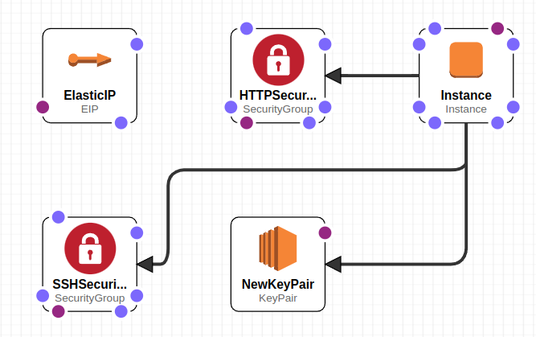

# AWS CloudFormationを利用したDeep Learning開発環境@EC2の自動構築・Cloud9初期セットアップ方法 <!-- omit in toc -->

[本リポジトリ](https://github.com/Renya-Kujirada/aws-cloud9/tree/master)では，AWS CloudFormationを利用し，EC2上にDeep Learning開発環境を自動構築するためのtemplate yamlを公開している．
本ドキュメントでは，このtemplate yamlとその利用方法について解説する．加えて，Cloud9を利用し，自動構築したEC2上でクラウドネイティブに開発を行う方法についても解説する．

## TL; DR <!-- omit in toc -->

AWSでDeep Learning開発環境を爆速で構築するために，以下に取り組んだ．

- Deep Learning AMIからEC2を自動構築するための[CloudFormation template]((https://github.com/Renya-Kujirada/aws-cloud9/blob/master/cloudformation/cftemplate_ec2_for_deep_learning.yaml))を作成した．
- 構築したEC2を利用してCloud9 SSH環境を構築する手順を整理した．
- Cloud9 SSH環境のフォーマッターや自動ハイパネーションの初期設定を自動実行するための[Shellスクリプト](https://github.com/Renya-Kujirada/aws-cloud9/blob/master/project_settings/setup_preference.sh)を作成した．

## 目次 <!-- omit in toc -->

- [背景](#背景)
- [CloudFormation templateについて](#cloudformation-templateについて)
  - [概要](#概要)
  - [構築するリソース](#構築するリソース)
  - [利用する AMI](#利用する-ami)
  - [template内のUserData内の補足](#template内のuserdata内の補足)
- [CloudFormation 実行手順](#cloudformation-実行手順)
- [Cloud9のセットアップ](#cloud9のセットアップ)
  - [Cloud9 SSH環境作成](#cloud9-ssh環境作成)
  - [Cloud9 IDE 初期設定](#cloud9-ide-初期設定)
    - [※SSH環境のstop my environment（自動ハイバネーション機能）について](#ssh環境のstop-my-environment自動ハイバネーション機能について)
  - [Cloud9上でのDocker Contanierの利用方法](#cloud9上でのdocker-contanierの利用方法)
  - [その他](#その他)

## 背景

Cloud9には，EC2環境とSSH環境という2種類のリソースの種別が存在する．EC2環境とは，EC2インスタンスを新規作成し，作成したEC2インスタンスにSSM Session Managerによって接続する方式のことである．SSH環境とは，既存のEC2インスタンスにSSH接続する方式のことである．

EC2環境の場合，EC2のライフサイクルを全てCloud9が自動で管理するため，ユーザ側での管理負担が少ないメリットがある．また，EC2環境では，AWS Managed Temporary Credentials(AMTC)を利用することができ，実質ほぼ無制限に他のリソースとの連携が可能である．このため，通常Cloud9を利用する場合，EC2環境で環境構築することが多い．[[1]](https://docs.aws.amazon.com/ja_jp/cloud9/latest/user-guide/ssh-settings.html)[[2]](https://docs.aws.amazon.com/ja_jp/cloud9/latest/user-guide/ec2-env-versus-ssh-env.html)

しかし，現状（2023/09/03），Cloud9でEC2環境を構築する場合，EC2インスタンスの初期スペックや利用可能なAMIに大きな制約が存在するため，以下に示すような課題が発生してしまう．
これにより，Cloud9を利用したDeep Learning開発環境を容易に構築することができない．
- Deep Learning用のAMIを選択できないため，以下の作業を全て手動で実施する必要がある．
  - NVIDIA ドライバーのインストール
  - NVIDIA Container Toolkit のインストール
  - （必要があれば適宜）CUDAおよびcuDNN, Pytorch, Tensorflow のインストール
- GPUインスタンスを選択できず，選択可能なインスタンスの種別は全てCPUであり，種類も少ない
- インスタンスのボリュームサイズを指定できない（初期ボリュームサイズは10GB）

加えて，現時点（2023/09/03）では，CloudFormationでCloud9を構築する場合，既存のEC2を指定したSSH環境を構築することはできない．一方，CloudFormationでEC2インスタンス自体を構築する場合，上記の課題は全て生じない．

そこで．EC2をCloudFormationで自動構築し，SSH環境のCloud9を構築することで，クラウドネイティブなDeep Learning開発環境を容易に構築できるようにした．

## CloudFormation templateについて

### 概要

[今回作成したCloudFormation template](https://github.com/Renya-Kujirada/aws-cloud9/blob/master/cloudformation/cftemplate_ec2_for_deep_learning.yaml)では，Deep Learning AMIからEC2インスタンスを構築する．その後，作成したEC2にSSH接続する形（SSH環境）でCloud9を利用することを想定している．
なお，SSH接続するために，以下に示す工夫を施している．
- EC2 Key pairを作成
- 静的なIPアドレス（Elastic IP）をEC2にアタッチ
- ポート番号22, 80をインバウンドルールとして許可するセキュリティグループを作成

### 構築するリソース

- EC2
- EC2 Key pair
- Elastic IP
- Security Group(Inbound: HTTP, SSH)



### 利用する AMI

```
AMI Name: Deep Learning AMI GPU PyTorch 2.0.1 (Ubuntu 20.04) 20230827 (x86)
仮想化: hvm
ENA 有効: true
ルートデバイスタイプ: ebs
説明: Supported EC2 instances: P5, P4d, P4de, P3, P3dn, G5, G4dn, G3. Release notes: https://docs.aws.amazon.com/dlami/latest/devguide/appendix-ami-release-notes.html
アーキテクチャ: 64 ビット (x86)
AMI ID: ami-06c414f3ba4a59e2f
```

### template内のUserData内の補足

- [SSH 環境ホスト要件](https://docs.aws.amazon.com/ja_jp/cloud9/latest/user-guide/ssh-settings.html)として，Python2とNode.jsがインストールされている必要があるため，これらをインストールしている．
- AMIのgitのバージョンが古いため，gitをアップグレードしている．
- Cloud9で快適にコーディングを行えるよう，autopep8をインストールしている．

## CloudFormation 実行手順

- [CloudFormationコンソール](https://console.aws.amazon.com/cloudformation/)を開き，スタックの作成を押下
- テンプレートの指定 > テンプレートファイルのアップロード > ファイルの選択で上記で作成したyamlファイルを指定し，次へを押下
  - [cloudformation/cftemplate_ec2_for_deep_learning.yaml](https://github.com/Renya-Kujirada/aws-cloud9/blob/master/cloudformation/cftemplate_ec2_for_deep_learning.yaml)をuploadする．
- 任意のスタック名を入力後，以下のパラメータを設定する
  - EC2InstanceType: インスタンスタイプ．デフォルトはg4dn.xlarge
  - ImageId: AMIのID．デフォルトはDeep Learning AMI GPU PyTorch 2.0.1のID
  - KeyName: EC2インスタンスのkey名．デフォルトはmy-key（任意の名前を入力）
  - SubnetID: 利用するパブリックサブネットID（デフォルトVPCのパブリックサブネットID等で問題ない）
  - VolumeSize: ボリュームサイズ．デフォルトは100GB
- 適切なIAM Roleをアタッチし，次へを押下（一時的にAdmin roleで実施しても良いかもしれない）
- 作成されるまで20秒ほど待つ

## Cloud9のセットアップ

[Cloud9コンソール](https://console.aws.amazon.com/cloud9/)を開き，Cloud9のSSH環境を構築する．詳細な手順は[公式ドキュメント](https://docs.aws.amazon.com/ja_jp/cloud9/latest/user-guide/create-environment-ssh.html)を参照されたい．

### Cloud9 SSH環境作成

- Create environmentを押下
- [Existing compute]を選択し，SSH公開鍵をクリップボードにコピー
- コピーしたcloud9のSSH公開鍵を，CloudFormationで作成したEC2の`.ssh/authirized_key` に追記
  - EC2コンソールからCloudFormationで作成したEC2に接続し，以下を実行
  - `echo "PUBKEYの内容" >> .ssh/authirized_key`
- Cloud9コンソールに戻り，以下の情報を入力
  - User: ubuntu
  - Host: EC2に割り当てたElastic IPアドレス
- 作成ボタンを押下
- Cloud9からのSSH接続完了後，Open in Cloud9を押下
- 自動でCloud9 IDEのインストールが始まる．基本的には全てデフォルトの設定でインストールして構わない．

### Cloud9 IDE 初期設定

Cloud9 IDE上で本リポジトリをCloneし，リポジトリ内のシェルを実行することで，容易にセットアップが可能である．

- [project_settings/setup_preference.sh](https://github.com/Renya-Kujirada/aws-cloud9/blob/master/project_settings/setup_preference.sh)を実行．以下の設定を自動実行する．
  - stop my environmentの設定（自動でインスタンスを停止してくれる設定）
  - python formatterの設定（ファイル保存時に自動でautopep8を実行する設定）
- その他，適宜aws configureを設定すると良い．
  - AWS CLI経由で実行すること．（手順は割愛する）

#### ※SSH環境のstop my environment（自動ハイバネーション機能）について

自動ハイパネーション機能とは，Cloud9 IDEを閉じてからユーザーが設定した時間を経過した場合，自動でEC2を停止する機能である．[SSH環境のホスト要件](https://docs.aws.amazon.com/ja_jp/cloud9/latest/user-guide/ssh-settings.html)に記載がある通り，自動ハイバネーション機能はEC2環境にて利用可能な機能である．

しかし，自動ハイパネーションの実態は，単純なshellのcronによるジョブ実行（毎分）であり，これはSSH環境でも実行可能である．以下に，調査した内容を解説する．

- `/etc/cron.d/c9-automatic-shutdown`: シャットダウンの条件を判断するスクリプト（`~/.c9/stop-if-inactive.sh`）を毎分起動するためのファイル
- `~/.c9/stop-if-inactive.sh`: `~/.c9/autoshutdown-configuration`に設定された時刻を超えた場合，シャットダウンするスクリプト
- `~/.c9/autoshutdown-configuration`: SHUTDOWN_TIME （単位は分）を指定するためのファイル

EC2環境のCloud9のcronファイルやcronジョブが実行しているshellをSSH環境に移植する形で，SSH環境における自動ハイパネーション機能を実現している．

### Cloud9上でのDocker Contanierの利用方法

上記までの手順以降，GPUインスタンス上でDockerコンテナを利用し，コンテナ上でGPUを利用したDeep Learningの開発が可能である．以下に手順を示す．
- [docker/build_image.sh](https://github.com/Renya-Kujirada/aws-cloud9/blob/master/docker/build_image.sh)を実行．これにより，ECRにログインし，AWSが提供しているDocker image（今回はhuggingface(pytorch) imageを指定している）をpull，buildが可能．
- [docker/run_container.sh](https://github.com/Renya-Kujirada/aws-cloud9/blob/master/docker/run_container.sh)を実行．これにより，buildしたイメージを元にコンテナを構築・起動し，ログイン可能．
- コンテナ内で[docker/exec_jupyterlab.sh](https://github.com/Renya-Kujirada/aws-cloud9/blob/master/docker/exec_jupyterlab.sh)を実行．これにより，jupyter labをCloud9で利用可能．

### その他

- Cloud9のSSH環境の場合，Cloud9のコンソール画面でOpenを押下する前に，EC2インスタンスを開始しておく必要がある．
- Cloud9 EC2環境が優れている点としては以下であると，SSH環境を利用して気づいた．
  - SSM接続可能なので，逐一EC2を起動せずとも直接アクセス可能．加えて，Cloud9 SSH環境構築時と異なり，SSH公開鍵の登録なども不要．
  - AWS Managed Temporary Credentials（AMTC）による，一時的な認証情報の利用が可能な点（実質ほぼ無制限に他のリソースとの連携が可能）．
